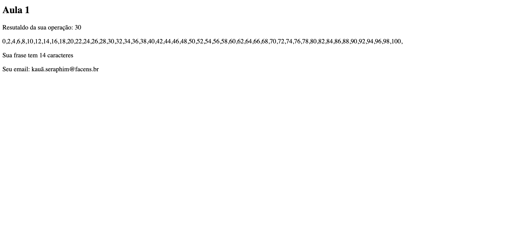
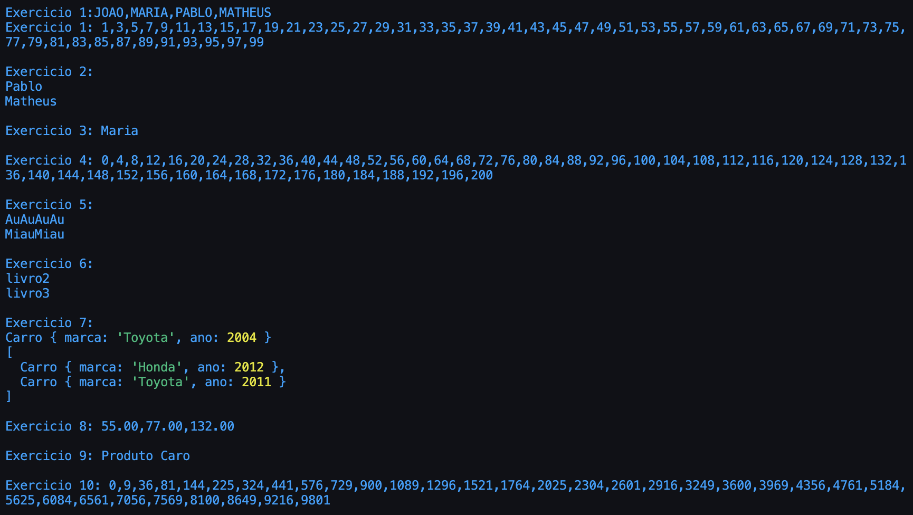
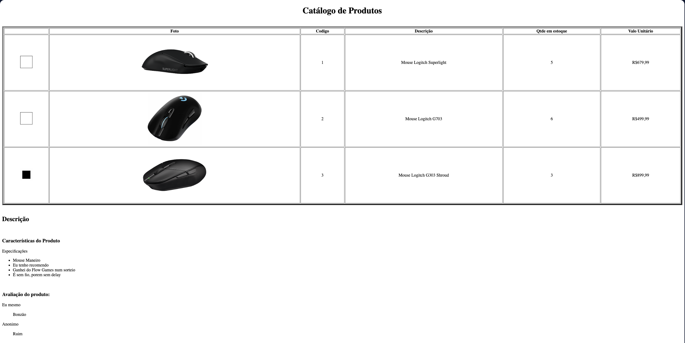
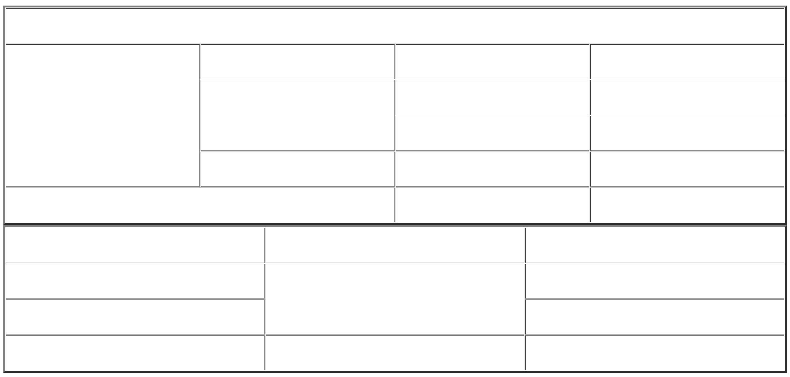
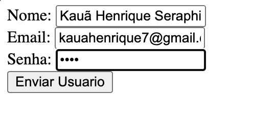

## Índice
- Exercício 1: [Codigo](exercicio_aula_1)
- Exercício 2: [Codigo](exercicio_aula_2)
- Exercício 3: [Codigo](exercicio_aula_3)
- Exercício 4: [Codigo](exercicio_aula_4)
- Exercício 5: [Codigo](exercicio_aula_5)

## Exercício 1:

1. Escreva um programa que declare duas variáveis numéricas e realize as quatro
operações matemáticas básicas (+, -, *, /). Imprima os resultados no console.
2. Faça um programa que mostre os números impares em um intervalo de 0 a 100.
3. Faça um programa que mostre a quantidade de caracteres para o texto “Disciplina de
Programação para web”.
4. Faça um programa que recebe o nome de uma variável e mostre o
<<primeiro>>.<<último nome>>@facens.br
Por exemplo:
A variável nome possui o conteúdo “Edson Martin Feitosa”.
Deve mostrar edson.feitosa@facens.br
5. Escreva um programa que imprima os números de 1 a 10 no console usando um loop.
Os número devem ser separados com um traço, ex.: 1 – 2 – 3 - ... – 10. Observação:
após o número 10 não pode ter um traço.
6. Faça uma função que mostre o dobro do número passado. Caso o número seja menor
ou igual a zero deve mostrar a mensagem “Só é aceito números positivos maiores que
zero”.
7. Escreva uma função que receba uma string como argumento e retorne a string
invertida.
8. Escreva uma função que recebe uma string como argumento e retorna o número de
vogais presentes nessa string. Considere apenas vogais minúsculas (a, e, i, o, u).
9. Escreva uma função que recebe um endereço de e-mail como argumento e retorna
true se o e-mail for válido ou false caso contrário. Um e-mail válido deve conter um
único símbolo '@' e pelo menos um ponto '.' após o '@'.
10. Escreva uma função que verifique se uma determinada string é um palíndromo (ou
seja, pode ser lida da mesma forma tanto da esquerda para a direita quanto da direita
para a esquerda).
Exemplo: arara

Resultado no HTML:

## Exercício 2: 

1. Crie uma classe Usuario com os atributos nome e idade. Em seguida, crie um array de
objetos Usuario e crie um novo array apenas com os nomes dos usuários em letras
maiúsculas.Faça um programa que mostre os números impares em um intervalo de 0 a
100
2. Continuando com a classe Usuario, filtre os usuários com idade superior a 18 anos.
3. Utilizando a classe Usuario, encontre o primeiro usuário com idade entre 25 e 30 anos.
4. Crie um array de números e filtre apenas os números pares. Em seguida, mapeie esses
números para o dobro de seus valores.
5. Crie uma classe Animal com os métodos emitirSom e correr. Crie subclasses Cachorro
e Gato que herdam de Animal e implementam o método emitirSom de forma
diferente para cada classe.
6. Crie uma classe Livro com os atributos titulo e paginas. Crie um array de objetos Livro
e filtre os livros com mais de 300 páginas.
7. Crie uma classe Carro com os atributos marca e ano. Crie um array de objetos Carro e
encontre o primeiro carro da marca "Toyota" e filtre os carros fabricados após 2010.
8. Crie uma classe Produto com os atributos nome e preco. Crie um array de objetos
Produto e mapeie esses produtos para um novo array com os preços aumentados em
10%.
9. Utilizando a classe Produto, encontre o primeiro produto com preço superior a R$
100,00 e altere o nome desse produto para "Produto Caro".
10. Crie um array de números e filtre apenas os números divisíveis por 3. Em seguida,
mapeie esses números para o quadrado de seus valores.

Resultado no console:

## Exercício 3:
1. Utilizando as tags para a marcação de texto definidas no slide “4- Web02 HTML 5”, crie uma
página html com o formato abaixo:
2. Crie a seguinte página abaixo.
3. Monte o código necessário para as seguintes tabelas:

Resultado HTML:

## Exercício 4:
Cursos e Inscrição
Uma escola infantil de cursos de extensão precisa criar uma página HTML para
listar os cursos que ela possui. Essa página deve mostrar os campos: o nome
do curso, sua descrição, turno/horário, professores e valor.
Cada curso deverá ter um link para o usuário se inscrever, esse enviará para a
tela de inscrição, passando como parâmetro na querystring o código do curso.
Para inscrever-se o usuário precisa informar os dados abaixo:
 Dados do aluno: Nome*, endereço, bairro, cidade, numero, cep,
complemento, estado, telefone, celular*, e-mail* e cor* (Branca, Preta,
Parda, Amarela, Indígena)
 Dados do Pai: Nome*, data nascimento, naturalidade, instrução,
profissão, celular*, email*, cpf* e se é ou não responsável financeiro
 Dados do Mãe: Nome*, data nascimento, naturalidade, instrução,
profissão celular*, email*, cpf* e se é ou não responsável financeiro
 Dados do curso: Nome do curso escolhido*, data de ingresso*, valor* e
forma de pagamento (qtde de parcelas)*
 Os campos em * são obrigatórios e não pode deixar salvar se não
estiver sido preenchido.
Os dados deverão ser salvos em um API (utilize o mockapi.io).

Resultado HTML:s

## Exercício 5:
Faça as seguintes alterações no texto com o auxílio do CSS
1. Altere a cor do fundo para uma tonalidade de marrom claro, o tamanho do texto para
40px, cor da letra branca, alinhe o texto no centro e a fonte da letra para “Lucida Sans”
2. Ao passar o mouse sobre o título o fundo deve mudar para a cor preta.
3. O conteúdo da página deve ser mostrado com a fonte “Arial”.
4. Todos os parágrafos devem ter um recuo de 20px.
5. O título introdutório da lista ordenada que possui a escrita: “Conceitos Fundamentais
de CSS:” deve estar com seu texto em negrito e a letra deve ter o tamanho de 20x.
6. Os itens da lista devem estar com alinhamento justificado.
7. Todo o conteúdo da página precisa ter um espaçamento superior e inferior de 50px e os
lados precisam ter um espaçamento de 200px

Resultado HTML:

