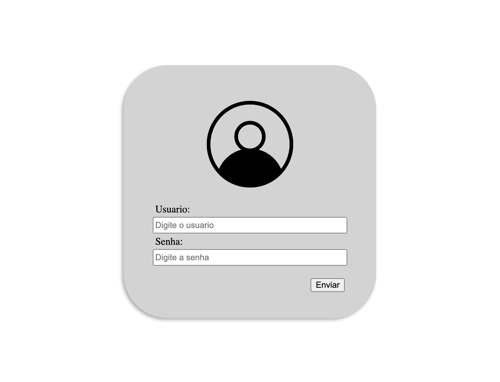
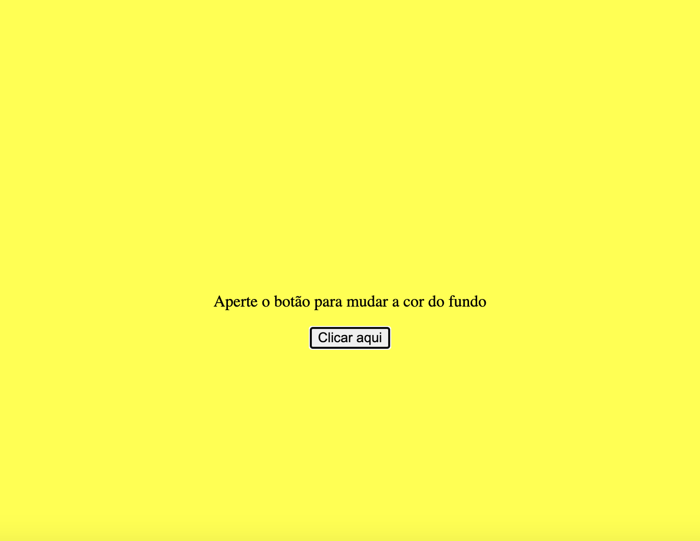
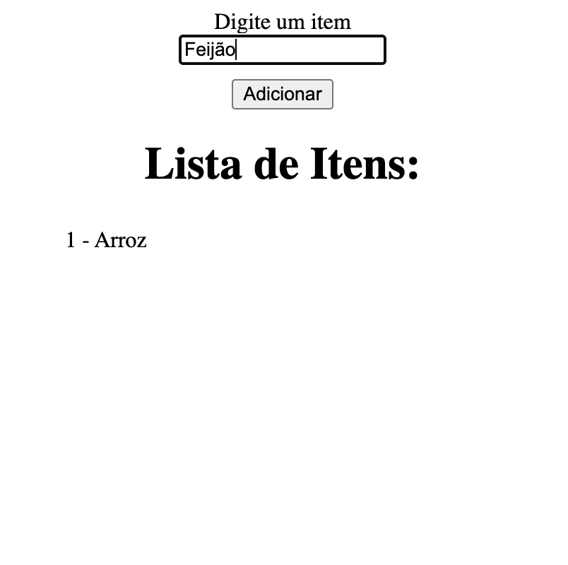
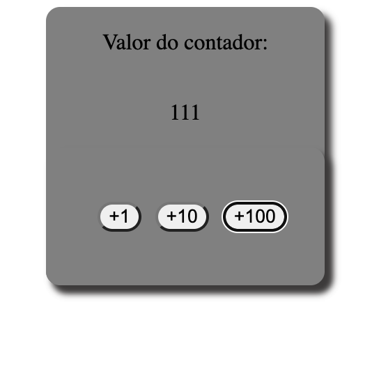
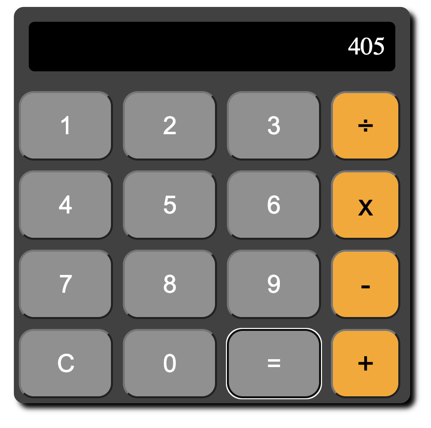
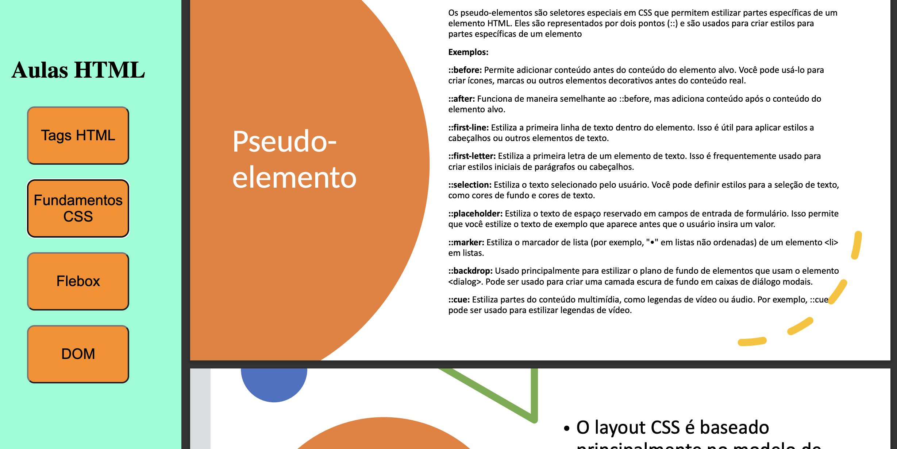
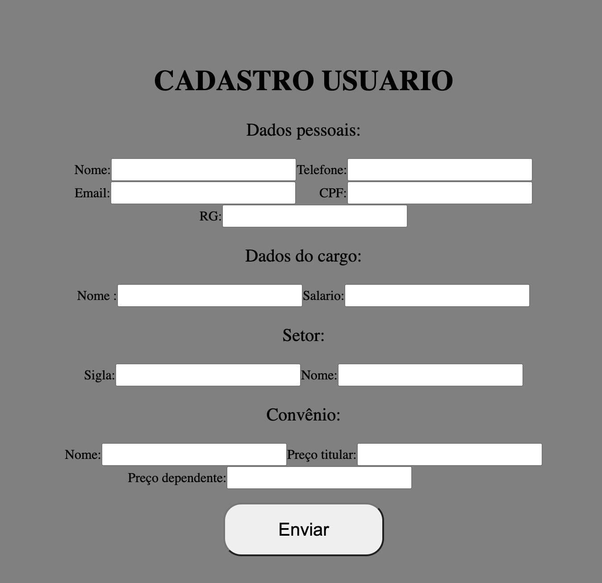

## Índice
- Exercício 7: [Codigo](exercicio_aula_7)
- Exercício 8: [Codigo](exercicio_aula_8)
- Exercício 9: [Codigo](exercicio_aula_9)
- Exercício 10: [Codigo](exercicio_aula_10)

## Exercício 7:

Com o auxílio do FlexBox faça uma tela de login centralizada no centro da página,
conforme imagem abaixo:

Resultado no HTML:

## Exercício 8: 

1. Crie uma página HTML com um botão e uma 
. Quando o botão é clicado, a cor de
fundo da 
 deve mudar para uma cor aleatória.
Obs.: Pode definir uma array com 5 cores que serão trocadas no click do botão. Para a escolha pode-se usar a classe
Math.randow (para escolher randomicamente) e Math.floor (arredondamento).
2. Crie uma página HTML com um campo de entrada de texto, um botão "Adicionar" e
uma lista de tarefas. Quando o usuário digita uma tarefa no campo de entrada e clica
no botão, a tarefa deve ser adicionada à lista.
Obs.: Para criar um novo elemento HTML utiliza-se o método createElement (Ex.: document.createElement('li');) e
para adicionar o novo elemento como filho de uma tag pode-se usar o método appendChild
3. Crie uma página HTML com um botão e um contador. Quando o botão é clicado, o
contador deve ser incrementado em 1 e o valor atualizado na página.
4. Crie uma página HTML que possui 2 campos e 4 botões (Somar, Subtrair, Dividir e
Multiplicar), ao colocar os números e clicar em um dos botões devem realizar a
operação escolhida.
Obs.: Antes de realizar a operação deve validar se foi digitado os números e se o usuário tentar dividir um número
por zero, deve mostrar a mensagem em um alert “Impossível dividir por zero”

### 8-1:

### 8-2:

### 8-3:

### 8-4:

## Exercício 9:
1. Desenvolva um menu lateral com links para as atividades:
• tags html
• css fundamentos
• flexbox
• DOM
Ao clicar, mostre ao lado do menu a atividade escolhida.
Observação, a página deve abrir a atividade dinamicamente sem abrir outra página.

## Exercício 10:

Hoje é o seu primeiro dia como desenvolvedor frontend web e como primeiro
trabalho, precisa desenvolver uma tela de cadastro de funcionário.
A tela deve ter as seguintes informações:
• Dados Pessoais
o Nome
o Telefone
o E-mail
o CPF
o RG
• Cargo
o Nome
o Salário
• Setor
o Sigla
o Nome
• Convênio
o Nome
o Valor para o titular
o Valor para o dependente
O cargo, setor e convênio devem ser selecionados pelo usuário, onde ao selecionar
completa as demais informações. Para isso, utilize os seguintes web services:
• https://aulalp2024.free.beeceptor.com/setor
• https://aulalp2024.free.beeceptor.com/cargo
• https://aulalp2024.free.beeceptor.com/convenio
Para salvar as informações foi passado o web service:
• https://66266bc2052332d55322d1f0.mockapi.io/funcionario
Importante: O chefe requisitou que os dados de cargo, setor e convênio devem ser baixados
em paralelo no momento que a tela de cadastro é carregada com o método Promise.All.

